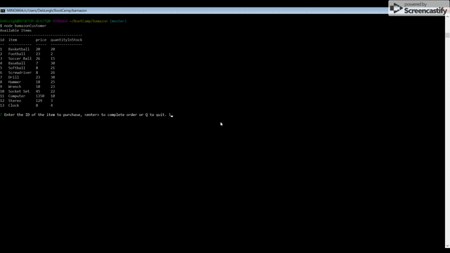
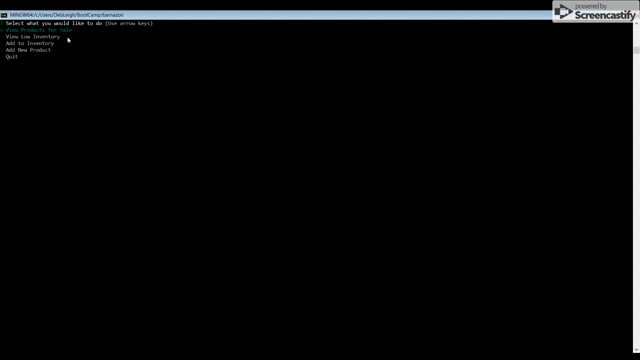
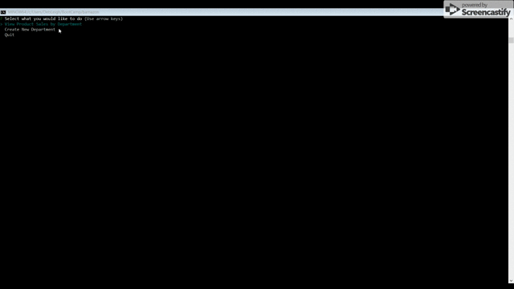

# bamazon!  
## Command Line Interface (CLI) on-line order system

#### Developed by Deb Warrick https://debwarrick.com

* bamazon is a Node.js program incorporating MySQL to store the inventory, with Inquirer to provide a user interface.
* bamazon can't be run from a URL, it must be executed using Node.js.

**bamazonCustomer.js** - Customers can buy your items through this CLI interface.  
**bamazonManager.js** - Manage your inventory: view products for sale, see those below inventory thresholds (5), add stock quantity to inventory, add a new product.  
**bamazonSupervisor.js** - will allow you to run a net profit report, and add a new department.  

## How it works

### NODE bamazonCustomer

* You will be shown a list of the products in the bamazon database, including the price and the quantity available.
* You will enter the id of the item you wish to order, and then the quantity.  
* You can purchase multiple items in one order.  When you are finished with your order, simply hit enter to complete your order.
* You must enter a valid item id and a quantity > 0.  If you order more than we have in stock, we'll let you know so you can adjust.
* If you have started an order and wish to cancel, type in Q.  
* You will be given an order total at the end.
  
##### Watch it in action.

### NODE bamazonManager

You will be given a menu to select from.  Use the up and down arrows to navigate through.

* View Products for Sale - will display our current inventory. 
* View Low Inventory - will list the item with a in-stock inventory of less than 5 so you know when to reorder.
* Add to Inventory - will allow you to log the receipt of additional quantity of existing items into inventory.  Enter multiple items,
  and then press enter to complete.
* Add New Product - will allow you to add a new product to our inventory.  You must select a valid department from the list.

##### Watch it in action.

### NODE bamazonSupervisor

You will be given a menu to select from.  Use the up and down arrows to navigate through.

* View Product Sales by Department - will give you a summary report of the profit by department based on the overhead vs sales for products by department .
* Create New Department - will allow you to add a new deparment for item entries.

##### Watch it in action.

### bamazon uses the following Node.js libraries that you must install.

**MySQL** - to allow for the interaction with the MySQL database.  
**inquirer** - to allow for the prompts for the execution.  
**keys** - the MySQL password is stored in a .env file to protect it.    
**dotenv** - used to protect my password.
**console.table** - to prettify the Node output.

You must have a MySQL installation and valid MySQL credentials loaded into a .env file in order to run it.
You can use the bamazon.sql file to create the database and table structures.

## Thank you for checking it out, and have fun!
